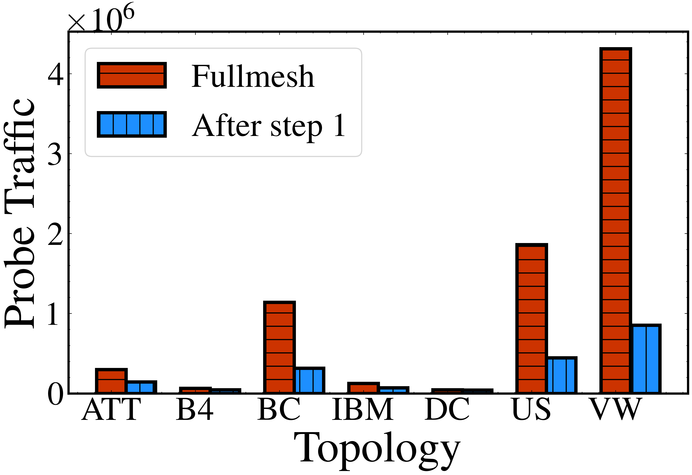
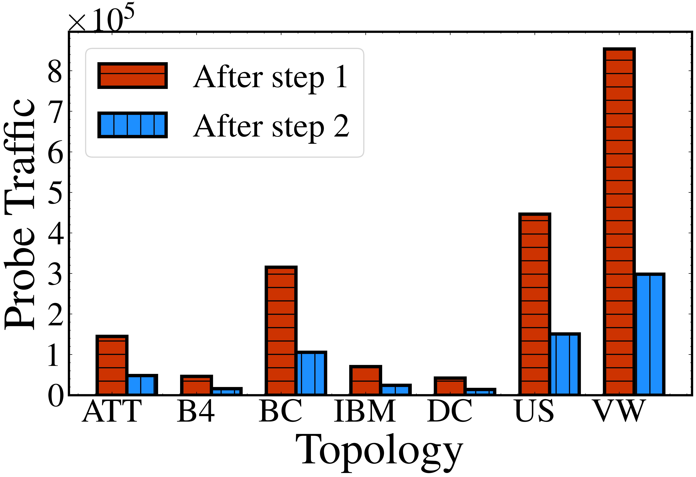
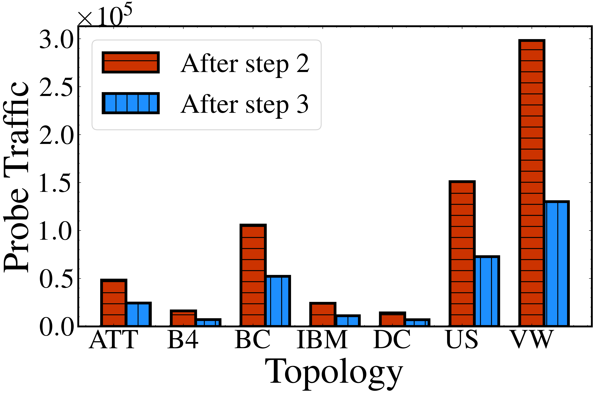
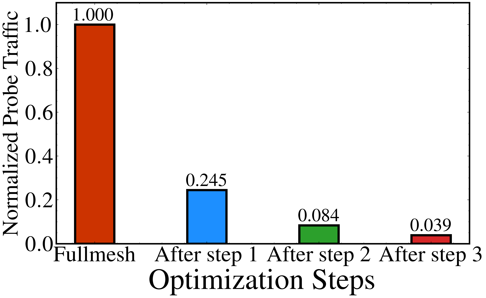

# SRmesh
Code for the paper "SRmesh: Deterministic and Efficient Diagnosis of Latency Bottleneck Links in SRv6 Networks" in IEEE ICNP 2025

### System Architecture

- **Frontend**: Web-based user interface for visualization and interaction (see `./frontend/`)
- **Controller**: Central orchestration component that manages the diagnosis process
- **Agent**: Distributed monitoring agents deployed on network nodes
- **Analyzer**: Data analysis component for processing network metrics
- **Docker Infrastructure**: Containerized deployment for easy scalability

## 🗓️ Project Timeline – 2025

| Month (2025)   | Task Description                                 | Status     |
|----------------|--------------------------------------------------|------------|
| Mid-August     | Core code implementation                         | ✅ 90% Complete |
| September      | Frontend development                             | 🚧 60% Complete |
| October        | Provide necessary utility scripts                | ☐ To Do     |
| December       | One-click deployment, testing, and optimization  | ☐ To Do     |

## 🚀 Quick Start

### Prerequisites

- Docker (version 20.10 or higher)
- Docker Compose (version 2.0 or higher)
- Linux environment with kernel version 5.4 or higher (recommended for eBPF support)
- At least 8GB RAM and 20GB disk space

### One-Click Deployment

```bash
# Clone the repository
git clone https://github.com/DeepShield-AI/SRmesh.git
cd SRmesh

# Build and deploy the entire system
cd docker
chmod +x run.sh
./run.sh

# Start the system
docker compose up -d
```


## 🔧 Configuration

### Network Topology

The system supports custom network topologies. Configure your topology in:
- `docker/conf/topo.json` - Primary topology configuration
- `docker/conf/topo2.json` - Alternative topology configuration

Example topology configuration:
```json
{
  "nodes": [
    {
      "id": "node1",
      "type": "router",
      "ipv6": "fc00::1/64"
    },
    {
      "id": "node2", 
      "type": "router",
      "ipv6": "fc00::2/64"
    }
  ],
  "links": [
    {
      "source": "node1",
      "target": "node2",
      "latency": "10ms"
    }
  ]
}
```

### Environment Variables

Key environment variables for configuration:

| Variable | Description | Default |
|----------|-------------|---------|
| `CONTROLLER_PORT` | Controller gRPC port | 50051 |
| `LOG_LEVEL` | Logging level | INFO |
| `METRICS_INTERVAL` | Metrics collection interval | 5s |

## 🔍 Monitoring and Troubleshooting

### Health Checks

```bash
# Check all services status
docker compose ps

# View controller logs
docker logs controller -f

# Check agent connectivity
docker exec point-1 ping fc00::2

# Monitor network traffic
docker exec controller tcpdump -i any -n
```

### Common Issues

1. **Port conflicts**
   ```bash
   # Check if port 50051 is in use
   ss -tnlp | grep 50051
   
   # Kill conflicting processes if needed
   sudo kill $(sudo lsof -t -i:50051)
   ```

2. **eBPF program loading failures**
   ```bash
   # Ensure kernel version support
   uname -r
   
   # Check BPF filesystem mount
   mount | grep bpf
   ```

3. **Network connectivity issues**
   ```bash
   # Verify Docker networks
   docker network ls
   
   # Check IP routing
   docker exec controller ip route
   ```

## 🧪 Algorithm Results

<div align="center">
   
  
  
  
</div>

SRmesh achieves **up to 95% reduction** in probe traffic through three-step optimization while maintaining comprehensive network coverage. See [`./simulation/`](./simulation/) for detailed results.

## 📚 Documentation

- [Controller README](./controller/README.md) - Controller component documentation
- [API Documentation](./docs/api.md) - API reference (coming soon)
- [Architecture Guide](./docs/architecture.md) - System architecture details (coming soon)


## 👥 Contributors

<table>
  <tr>
    </td>
    <td align="center">
      <a href="https://github.com/KenyonZhao233">
        
        <br />
        <sub><b>KenyonZhao233</b></sub>
      </a>
      <br />
      <sub>Major Contributor</sub>
    </td>
    <td align="center">
      <a href="https://github.com/tongy21">
        
        <br />
        <sub><b>tongy21</b></sub>
      </a>
      <br />
      <sub>Major Contributor</sub>
    </td>
  </tr>
</table>

## 🔗 Citation

Coming soon.
