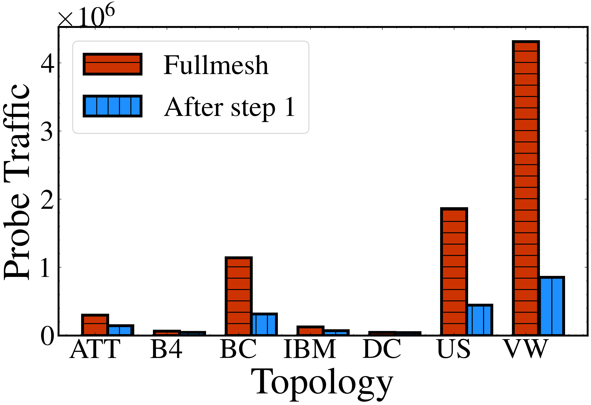
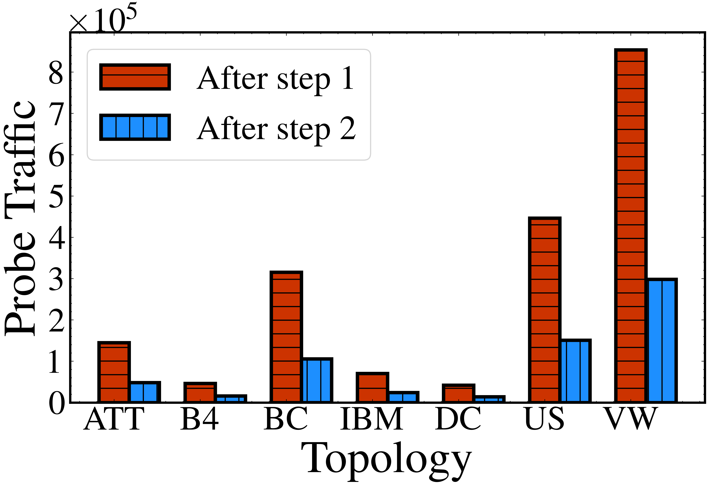
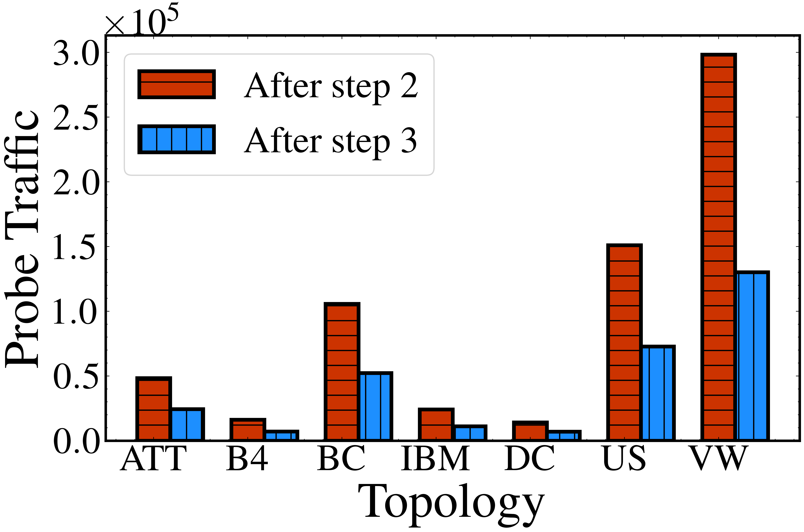
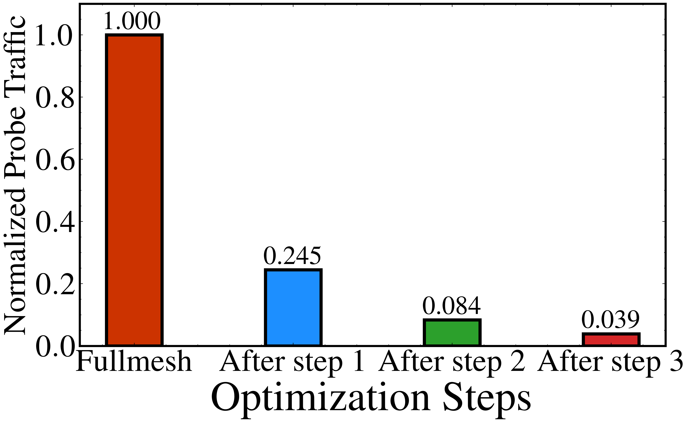

<div align="center">
  <h1>SRmesh</h1>
  <p><em>Code for the paper "SRmesh: Deterministic and Efficient Diagnosis of Latency Bottleneck Links in SRv6 Networks" in IEEE ICNP 2025</em></p>
</div>

---

## System Architecture

| Component | Description |
|-----------|-------------|
| **Frontend** | Web-based user interface for visualization and interaction (see `./frontend/`) |
| **Controller** | Central orchestration component that manages the diagnosis process |
| **Agent** | Distributed monitoring agents deployed on network nodes |
| **Analyzer** | Data analysis component for processing network metrics |
| **Docker Infrastructure** | Containerized deployment for easy scalability |

## 🗓️ Project Timeline – 2025

| Month (2025)   | Task Description                                 | Status     |
|----------------|--------------------------------------------------|------------|
| Mid-August     | Core code implementation                         | ✅ 95% Complete |
| September      | Frontend development                             | ✅ 90% Complete |
| October        | Provide necessary utility scripts                | ✅ 90% Complete     |
| December       | One-click deployment, testing, and optimization  | 🚧 50% Complete     |

## 🚀 Quick Start

### Prerequisites

| Requirement | Details |
|-------------|---------|
| Docker | Version 20.10 or higher |
| Docker Compose | Version 2.0 or higher |
| Linux environment | Kernel version 5.4 or higher (recommended for eBPF support) |
| Resources | At least 8GB RAM and 20GB disk space |

### One-Click Deployment

```bash
# Clone the repository
git clone https://github.com/DeepShield-AI/SRmesh.git
cd SRmesh

# Build and deploy the entire system
cd docker
chmod +x run.sh
./run.sh

# Start the system
docker compose up -d
```

## 🔧 Configuration

### Network Topology

> The system supports custom network topologies. Configure your topology in:

- `docker/conf/topo.json` - Primary topology configuration
- `docker/conf/topo2.json` - Alternative topology configuration

Example topology configuration:
```json
{
  "nodes": [
    {
      "id": "node1",
      "type": "router",
      "ipv6": "fc00::1/64"
    },
    {
      "id": "node2", 
      "type": "router",
      "ipv6": "fc00::2/64"
    }
  ],
  "links": [
    {
      "source": "node1",
      "target": "node2",
      "latency": "10ms"
    }
  ]
}
```

## 🚦 Automatic Delay Injection & Bottleneck Diagnosis

SRmesh supports automatic injection of artificial delay (latency bottlenecks) for testing and diagnosis. This feature is integrated into the deployment and analysis workflow.

<details>
<summary><strong>Step 1: Inject Delay via <code>run.sh</code></strong></summary>

You can specify delay injection for any container interface when starting the system:

```bash
cd docker
# Syntax: ./run.sh --delay <container> <interface> [delay]
./run.sh --delay Wulumuqi eth1 100ms
# You can specify multiple --delay parameters in one command
./run.sh --delay Wulumuqi eth1 100ms --delay Beihang eth2 200ms
```

This will automatically set the specified delay (default: 200ms if omitted) on the given container interface(s) after startup. All delay settings are applied before the system begins probing.

</details>

<details>
<summary><strong>Step 2: Check Delay Configuration</strong></summary>

To verify the current delay (netem) settings on all containers, use:

```bash
cd docker
./check_delay.sh
```

This script will print the network interfaces and their delay rules for each running container, helping you confirm that artificial bottlenecks are in effect.

</details>

<details>
<summary><strong>Step 3: Run Automated Bottleneck Diagnosis</strong></summary>

After running the system and collecting probe data, the analyzer will automatically diagnose and report bottleneck links:

- The analyzer (`analyzer/analyzer.py`) is invoked automatically at the end of `run.sh` (on exit or Ctrl+C), or can be run manually:

```bash
cd analyzer
python3 analyzer.py
# Optionally specify a custom bottleneck threshold (ms):
python3 analyzer.py 80
```

The analyzer will output:
- Estimated per-link delays
- Detected bottleneck links (with severity)
- A summary report

This workflow enables end-to-end testing of delay injection, verification, and diagnosis in SRmesh.

</details>

### Environment Variables

Key environment variables for configuration:

| Variable | Description | Default |
|----------|-------------|---------|
| `CONTROLLER_PORT` | Controller gRPC port | 50051 |
| `LOG_LEVEL` | Logging level | INFO |
| `METRICS_INTERVAL` | Metrics collection interval | 5s |

## 🔍 Monitoring and Troubleshooting

### Health Checks

```bash
# Check all services status
docker compose ps

# View controller logs
docker logs controller -f

# Check agent connectivity
docker exec point-1 ping fc00::2

# Monitor network traffic
docker exec controller tcpdump -i any -n
```

### Common Issues

<details>
<summary><strong>1. Port conflicts</strong></summary>

```bash
# Check if port 50051 is in use
ss -tnlp | grep 50051

# Kill conflicting processes if needed
sudo kill $(sudo lsof -t -i:50051)
```

</details>

<details>
<summary><strong>2. eBPF program loading failures</strong></summary>

```bash
# Ensure kernel version support
uname -r

# Check BPF filesystem mount
mount | grep bpf
```

</details>

<details>
<summary><strong>3. Network connectivity issues</strong></summary>

```bash
# Verify Docker networks
docker network ls

# Check IP routing
docker exec controller ip route
```

</details>

## 🧪 Algorithm Results

<div align="center">
   
  
  
  
</div>

SRmesh achieves **up to 95% reduction** in probe traffic through three-step optimization while maintaining comprehensive network coverage. See [`./simulation/`](./simulation/) for detailed results.

## 📚 Documentation

> - [Controller README](./controller/README.md) - Controller component documentation


## 👥 Contributors

<table>
  <tr>
    <td align="center">
      <a href="https://github.com/KenyonZhao233">
        
        <br />
        <sub><b>KenyonZhao233</b></sub>
      </a>
      <br />
      <sub>Major Contributor</sub>
    </td>
    <td align="center">
      <a href="https://github.com/tongy21">
        
        <br />
        <sub><b>tongy21</b></sub>
      </a>
      <br />
      <sub>Major Contributor</sub>
    </td>
  </tr>
</table>

## 🔗 Citation

@INPROCEEDINGS{11192455,
  author={Zhao, Kaiyang and Zhang, Han and Tong, Yao and Li, Yahui and Shi, Xingang and Wang, Zhiliang and Yin, Xia and Wu, Jianping},
  booktitle={2025 IEEE 33rd International Conference on Network Protocols (ICNP)}, 
  title={SRmesh: Deterministic and Efficient Diagnosis of Latency Bottleneck Links in SRv6 Networks}, 
  year={2025},
  volume={},
  number={},
  pages={1-12},
  keywords={Accuracy;Uncertainty;Protocols;Network topology;Scalability;Redundancy;Prototypes;Transforms;Routing;Probes},
  doi={10.1109/ICNP65844.2025.11192455}}
